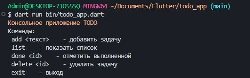

# TODO Console App

Консольное приложение для управления списком задач на языке Dart.

## Автор
- Имя: Богданов Иван и Шумила Диана
- Группа: ИСП-233

## Скриншот приложения


## Как запустить
```bash
git clone <URL вашего репозитория>
cd todo_app
dart pub get
dart run bin/todo_app.dart
```
### Что изучили
Null Safety в Dart

Именованные параметры функций

Классы и конструкторы

Работа с коллекциями

Асинхронное программирование

Ответы на вопросы
1. Чем final отличается от const в Dart?
final вычисляется во время выполнения, const вычисляется на этапе компиляции.

2. Что означает String?
String? означает nullable тип - переменная может быть null. String без ? не может быть null.

3. Чем Future отличается от обычного значения? Что означает await?
Future представляет результат асинхронной операции который появится позже. await приостанавливает выполнение функции но не блокирует поток.

4. Зачем в Dart именованные конструкторы?
В Dart нет перегрузки конструкторов, именованные конструкторы позволяют создавать несколько способов инициализации объектов.